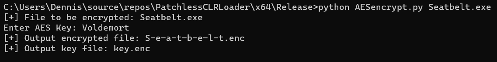
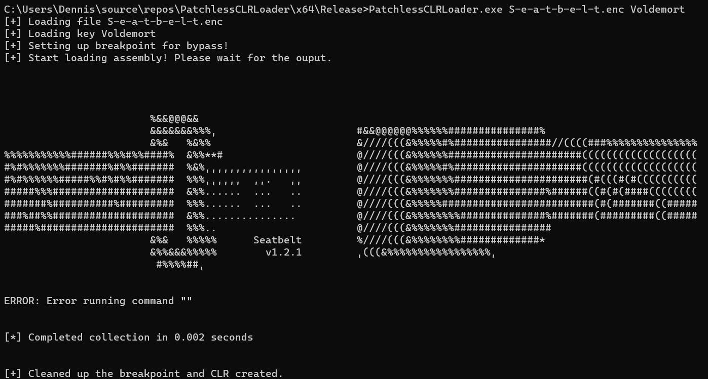
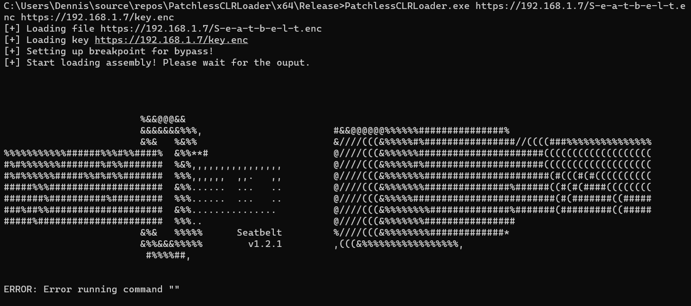

# PatchlessCLRLoader
PatchlessCLRLoader is a fork of InlineExecute-Assembly to load .NET assembly and direct the output to mailslot. I rewrites it to a standalone loader with the following implementation:
<ul>
  <li>AES encryption payload</li>
  <li>Fileless payload support</li>
  <li>Patchless AMSI and ETW bypass using hardware breakpoint</li>
</ul>

Using hardware breakpoints for patchless bypass has multiple advantages over traditional patching techniques. Firstly, it avoids using widely-known APIs such as NtProtectVirtualMemory, which are closely monitored by security solutions. Secondly, hardware breakpoints do not require any modification to the files, which could be  detected by file integrity monitoring or EDR, resulting in a relatively stealthy approach.


# Usage

<b>AES Encrypt Payload</b>



<b>Execute</b>
```texinfo
PatchlessCLRLoader.exe <payload> <key> <arguments>
```
<b>Local Payload</b>



<b>Remote Payload</b>



# Bug
The process may hang due to an access violation during CLR, but this issue can be overcome by using output function of the loaded .NET assembly, if it is supported. (e.g. -outputfile of Seatbelt). Pending Fix.

# Credits
@rad9800 implementation of patchless hook

InlineExecute-Assembly - <https://github.com/anthemtotheego/InlineExecute-Assembly>
